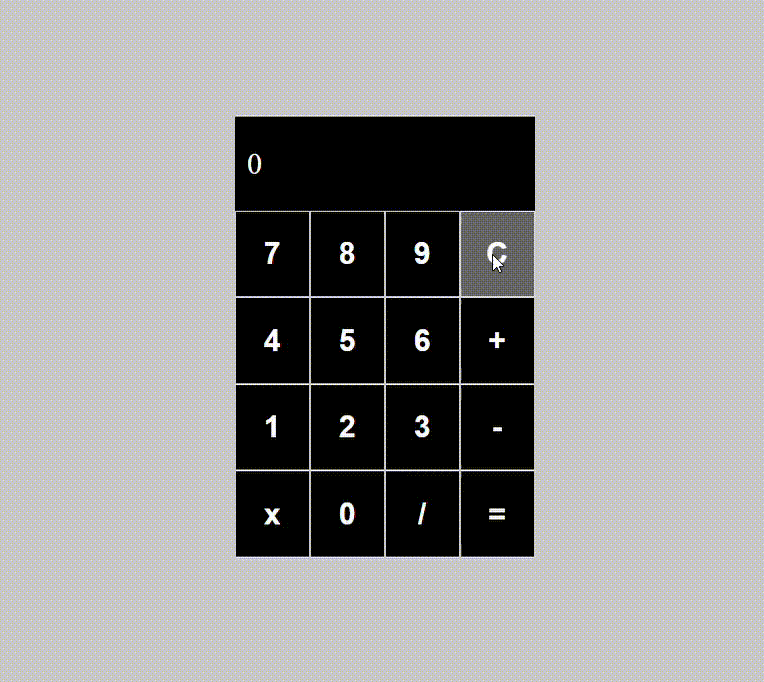

# Desafio 1 DIO, calculadora em react com as 4 operações básicas

Tecnologias:

Execução do projeto:
- Extraí todos os zips em uma única pasta;
- No terminal entre na pasta dio e execute o comando abaixo para executar o projeto:
> npm start

 

  

